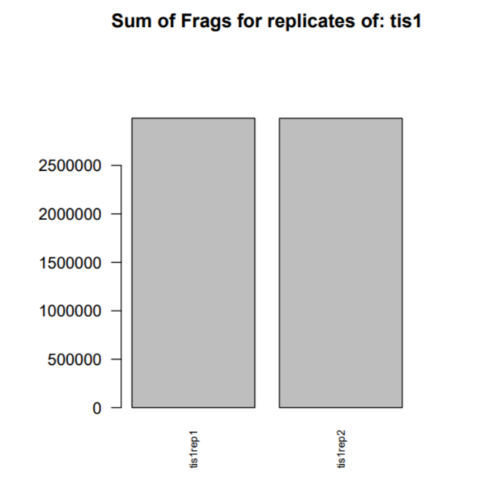

###  实验N: 实验名称
---

姓名:学生王  学号: 20180119201 日期: 2021-01-18


### 1. 实验目的

至少写150字来说明实验目的。整个实验报告的目的，是为了让不做实验的第三者，能够完整地了解实验过程和结果。

请注意此文档中的标题序号方式，我们采用本文档示例的方式来表示标题的4个级别，如2，2.1，（1），（a）。

### 2. 实验准备

#### 2.1 实验平台

请指出是华为云，还是虚拟机，操作系统的信息（uname -a）

#### 2.2 数据简述

用表格形式描述，简要描述此次实验所用数据，数据来源

#### 2.3 软件配置

（1）列出实验中用到的关键软件名，版本，来源及其安装方法，如果有特殊的安装等情况，请指出。

（2）软件列出方法，可以做表格，也可以使用list。

### 3. 实验内容

分为多个实验内容，如实验指导书中的Part1, Part2, Part3等。这里需给出一个实验线路，也就是先做什么，后做什么，最后做什么。

**注意：这个部分不可以为空**

#### 3.1 内容1标题

这里写实验1的内容摘要，不可为空。

每个实验内容包含了多个步骤，常见的步骤包括：脚本修改、环境变量配置、命令执行、确认结果、数据下载、IGV确认等环节。给出这些步骤的同时，请注意以下细节：


（1）如有脚本且需要修改，请列出修改后内容。

（2）如果有特殊的软件安装和配置，也在此说明。

（3）必须列出命令以表示一个实验步骤。

  列出脚本或者命令的同时，**必须给出简要的脚本说明**。注意：脚本或命令使用Markdown标记（```bash）来标注。**脚本不可以使用截图的方式来给出。**

```
export PATH=$PWD:$PATH
gatk
```
（4）如果中间结果需要确认，请指出确认方法。

  如果数据很多，使用head 命令展示前几行数据就可以，不建议使用EXCEL或者less 命令占满整页。

（5）如果输出了表格数据的话，请指出文件名及其记录和列数，使用head命令展示前几行数据

（6）如果有图形结果，请对图形做解释。



> 图像解释要细致，给出的信息要丰富，不要期望读者去自己发现这些信息。比如解释IGV的图，给出每个Track的数据意义，不要仅仅说，数据有差别，找到了峰值等。

请注意：

（a）如果展示的图形是多图拼出来的，请对每个子图做出解释。

（b）适当的使用方法，缩小一下图片，免得有些图片太大，占了半个页面。

（c）从Terminal截图附在文档时，注意不要让图内的文字比正文大，这样显得布局很不合理。

（d）这一部分展示了四级标题的序号方式，也就是（a）（b）（c）。

（7）如果可能的话，请给出脚本或者命令执行的大致时间。

### 4. 实验总结

#### 4.1 实验结论

整个实验的结论，这个是必写项目。从上述的几个实验内容中，你可以得到什么样的结论。

#### 4.2 实验收获

必写项目，记录自己学习到了什么样的实验方法或者技巧

#### 4.3 其它心得

这个不是必须项目
